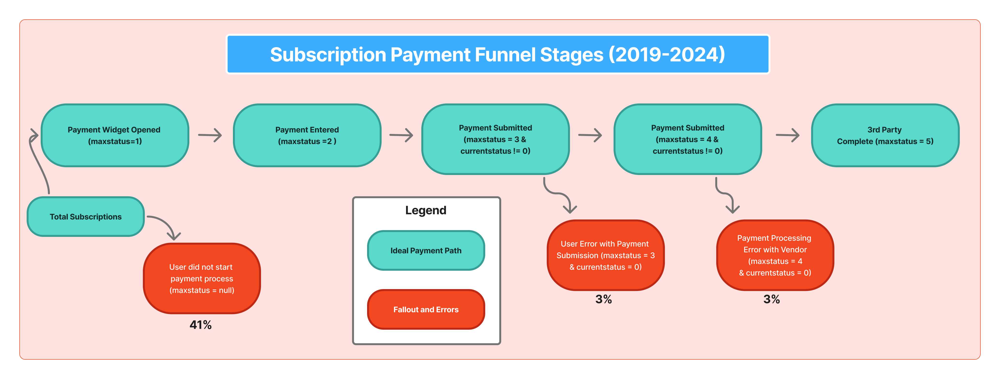
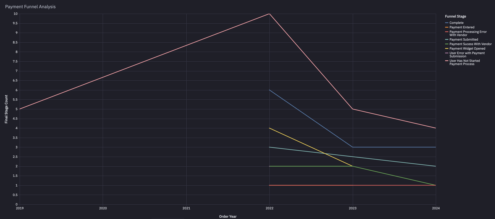
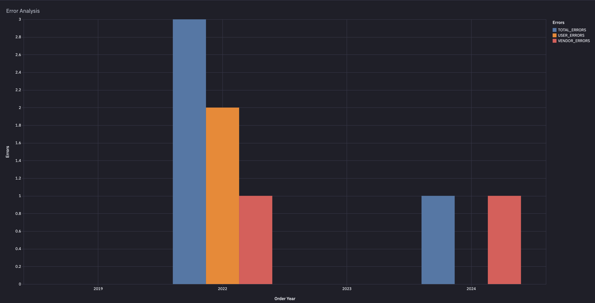
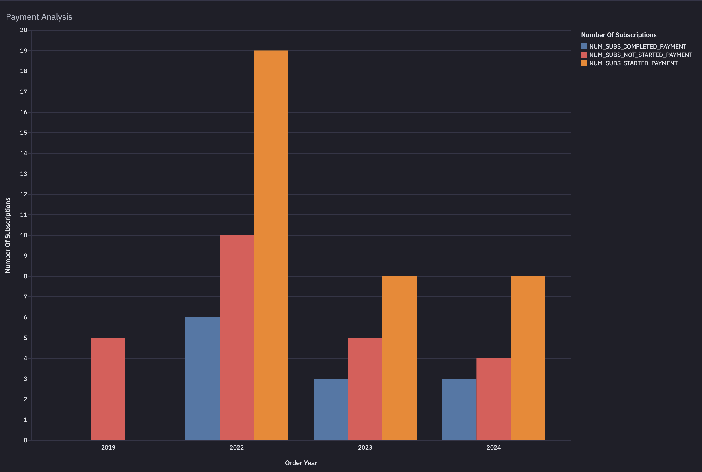
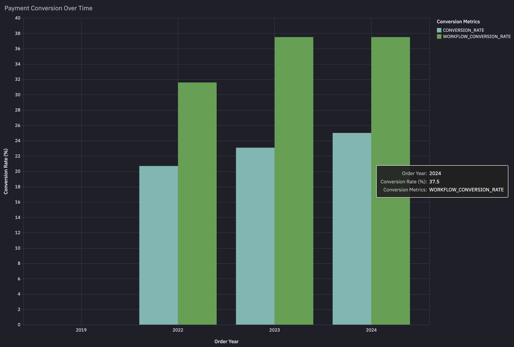

# Payment Funnel Analysis SaaS Fintech

## Executive Summary:

Conversion from subscription created to successfully paid is lower than expected at our SaaS company, and we need to understand why so many subscriptions remain unpaid. Using SQL and a Hex notebook on top of our Snowflake data, I rebuilt the payment funnel to track subscriptions from creation through payment portal entry, payment submission, and third‑party vendor processing. The analysis shows that many subscriptions never start the payment process and remain stuck in the “User Has Not Started Payment Process” stage.

After identifying that the largest opportunities are getting more users to start the payment process, reducing user errors during payment entry, and addressing vendor‑side failures, I recommend several targeted changes to increase conversion:

1. Streamline the payment experience with faster, lower‑friction options (e.g., Apple Pay/Google Pay and simpler forms)
2. Re‑engage unpaid subscriptions with reminder emails, texts, or in‑app prompts so more users enter the payment portal
3. Partner with the payment processor to monitor and reduce vendor‑side errors

## Business Problem:
Paid subscriptions are directly tied to revenue for this SaaS company, but the product and finance teams have noticed a lower-than-expected conversion rate from started subscriptions to successfully paid subscriptions. Many users are opting into a plan but never completing payment in the online portal. We need to understand how subscriptions move through the payment funnel, where they fall out (e.g., portal entry, card submission, vendor processing), and how often user vs. vendor errors occur so we can make product and technical changes that increase successful payments.

## Methodology:
* EDA
* Product Funnel Analysis
* Data Visualization

## Skills:
* SQL
* CTEs, CASE, subqueries, 
* Data visualization
* Data Wrangling
* Data Cleaning
* Data Science Notebook
* Snowflake Data Warehouse

## Results & Business Recommendation:
Results:
The payment funnel analysis shows that a large share of customers never begin the payment process at all, representing the biggest drop-off in the funnel and a major missed revenue opportunity. Among those who do start, we see friction on both the user side and the vendor side: some customers run into errors when submitting payment details, while a similar number experience failures during processing with the third party payment provider. 

Taken together, the Payment Funnel Analysis, Error Analysis, Payment Analysis, and Conversion Rate Over Time charts point to three main issues: a large share of customers never begin the payment process, many who do begin fail to successfully complete it, and payment failures appear to stem from a mix of customer‑side friction (e.g., behavior, input, or clarity issues) and vendor‑side processing problems that are occurring at similar rates.

This chart shows how subscriptions progress from creation through each payment step and highlights that the largest drop‑off occurs before customers even start the payment process, representing the biggest immediate opportunity to increase paid conversions.

This view breaks down payment failures by error type and stage, revealing a mix of user‑side issues (e.g., invalid details or abandoned attempts) and vendor‑side processing errors that together significantly reduce successful payments.

This chart summarizes payment outcomes across the funnel and quantifies how many subscriptions end in successful payment vs. failure, making clear that a meaningful share of interested customers never convert to paid due to friction in the payment experience.

This trend line tracks conversion from subscription created to successfully paid over time, showing how payment performance fluctuates and helping us identify periods where changes in product, process, or vendor reliability may have impacted results.

Business Recomendations:
* Work with the product manager to get more subscriptions to open the payment portal and try to pay. Right now, many customers never reach the payment page, so we lose revenue early in the funnel. Add simple payment reminder emails, in-app messages, and targeted outreach from customer service to bring more people into the payment flow.
* Reduce friction on the enter payment page by considering Apple Pay, Google Pay, or other payment methods that don't require entering in a credit card every time. This will help reduce user errors due to incorrect payment info.
* Add clear, specific error messages when a payment fails (for example, “Card declined, try another card” instead of a generic error). This helps customers understand what went wrong and successfully try again.
* Reach out to the 3rd party payment processing vendor and inquire about the errors on their side and determine a plan reduce those in the future.

## Next Steps:
* Investigate why subscriptions aren't even starting the payment process. Is it a process issue on our side? Are customers forgetting?
* Track payment funnel metrics over time (such as start rate, completion rate, and error rate) to see if things are improving or getting worse.
* Review the payment page on different devices and browsers to check for any technical issues or confusing layouts that might stop people from paying.
* Look at customer support tickets or feedback related to payments to see if there are common pain points or confusion you can fix in the product.
* Run small A/B tests on the payment page (such as different button text or layout) and measure if these changes increase the number of successful payments.

